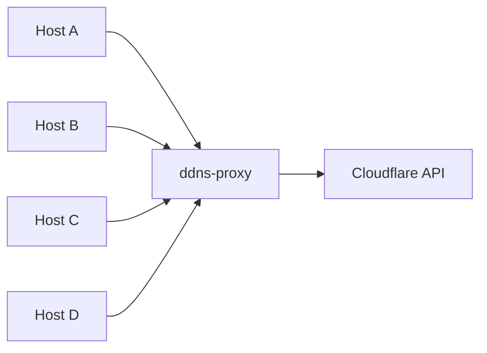

# ddns-proxy

I'm using [ddns-updater](https://github.com/qdm12/ddns-updater) on multiple hosts to update my dynamic DNS (DDNS) records. Each host needs to update a single DNS record, but to do so they need to have an API key with full access to the entire DNS zone (a limitation of the Cloudflare API). This is not ideal for security reasons, so I created this proxy to allow each host to update only a single record.



Note: this is a hobby project, mainly to play around with .NET Native AOT. I'm using it internally only, so security is not a primary concern. Use at your own risk!

## Usage

1. [Create an API token](https://developers.cloudflare.com/fundamentals/api/get-started/create-token/) in Cloudflare that has read & write permissions for the DNS zone(s) you want to update
1. Create the DNS record(s) you want to update
1. Start the `ddns-proxy` container with the API token, for example using Docker Compose:
   ```yaml
   services:
     ddns-proxy:
       image: ghcr.io/louismt/ddns-proxy:latest
       environment:
         - CLOUDFLARE__APITOKEN=your_api_token
         - DDNS__RECORDS__0__KEY=some_unique_key
         - DDNS__RECORDS__0__ZONEID=your_zone_id
         - DDNS__RECORDS__0__DNSRECORDID=your_dns_record_id
       ports:
         - 8080
   ```
1. To get the DNS record ID(s), you can call `http://docker-ip:8080/list?zoneId=your_zone_id`
1. Add as many records to the configuration as you need, using unique keys for each record
1. Configure ddns-updater on each host to use the `ddns-proxy` as the endpoint, for example:
   ```json
   {
     "provider": "custom",
     "domain": "example.com",
     "url": "http://docker-ip:8080/update?key=some_unique_key",
     "ipv4key": "ipv4",
     "ipv6key": "ipv6",
     "success_regex": "\"success\":true",
   }
   ```
